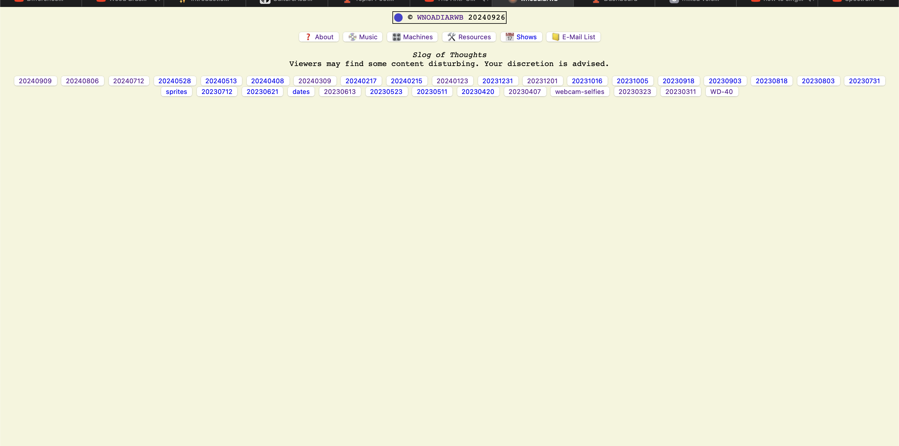
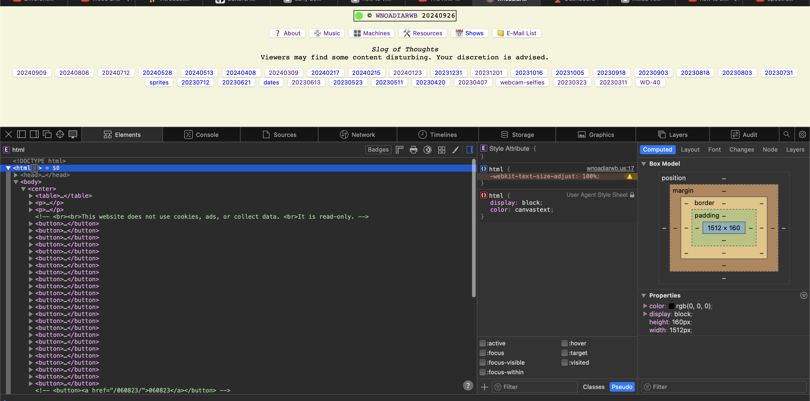
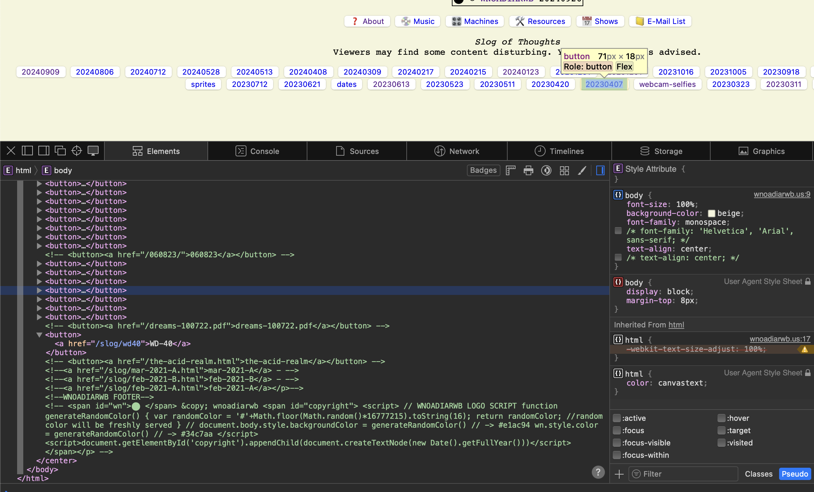
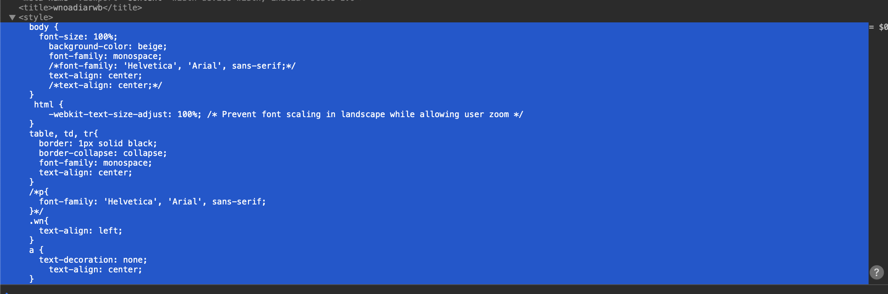

The website I am exploring is https://wnoadiarwb.us, which is website that serves as a blog/archive for the musician Otto Benson. The website contains a diretory l;ike system with buttons that link to dates. The pages with these dates as the titles have drawing, tour dates and recorded music, made or performed by Otto Benson. 

It has got a really minimal style, reminiscent of early "wild west" internet stylings. It's most likely ran by Otto Benson himself, he often incororates usage of programing and self made elctronics in his art so this would be in character for him. The quirky yet utilitarian structure of the website uses both HTML, CSS and JavaScript. There doesn't seem to be any github or other documentation linked with this website. 

 
Here we can see the usage of HTML to create these buttons, as well as standard document information in the first tree(Character set and title). At the bottom of this HTML body tag, there is a javascript function for a random color dot, that is featured first thing on the page next to the trademark. 

Here is the single CSS stylesheet used on this website. Its quite simple, there doesn't seem to be any other files. 
